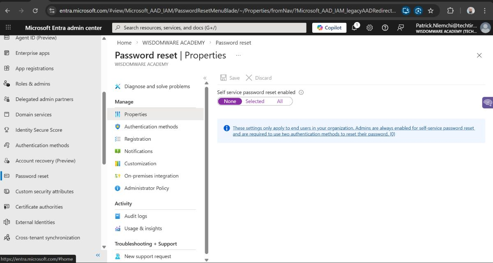
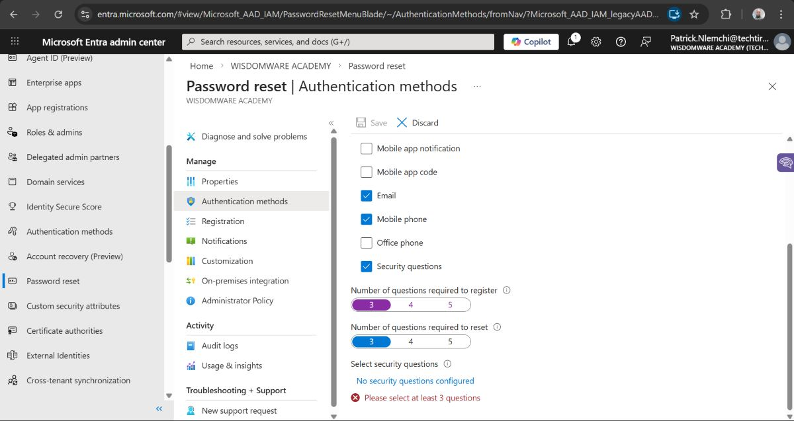
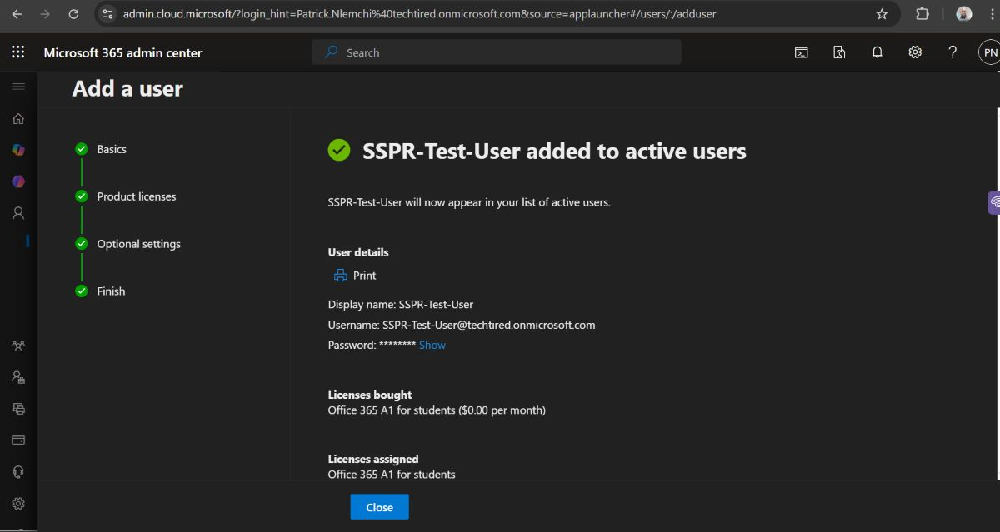
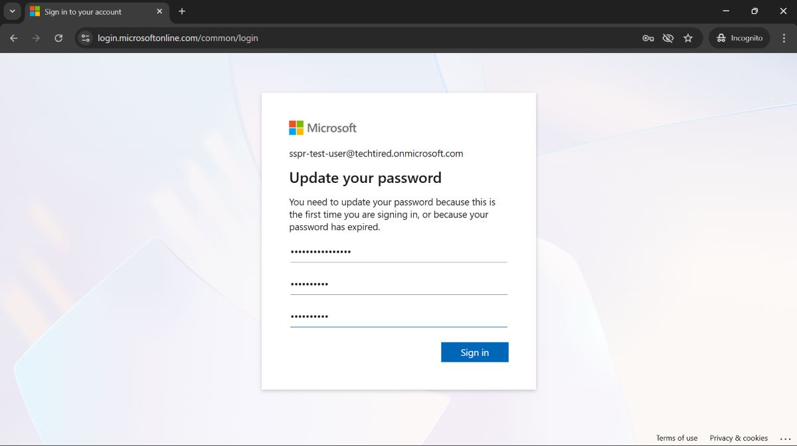
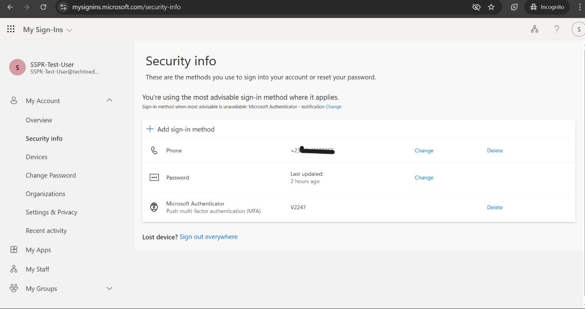
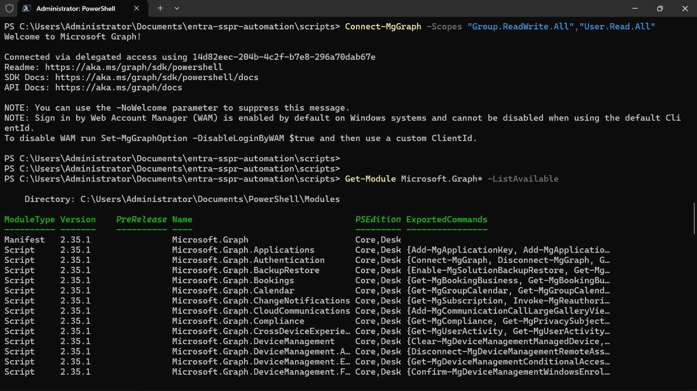
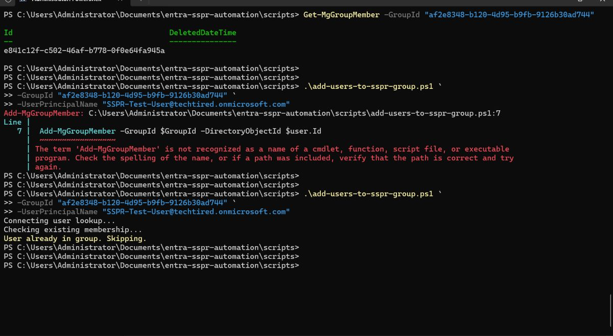
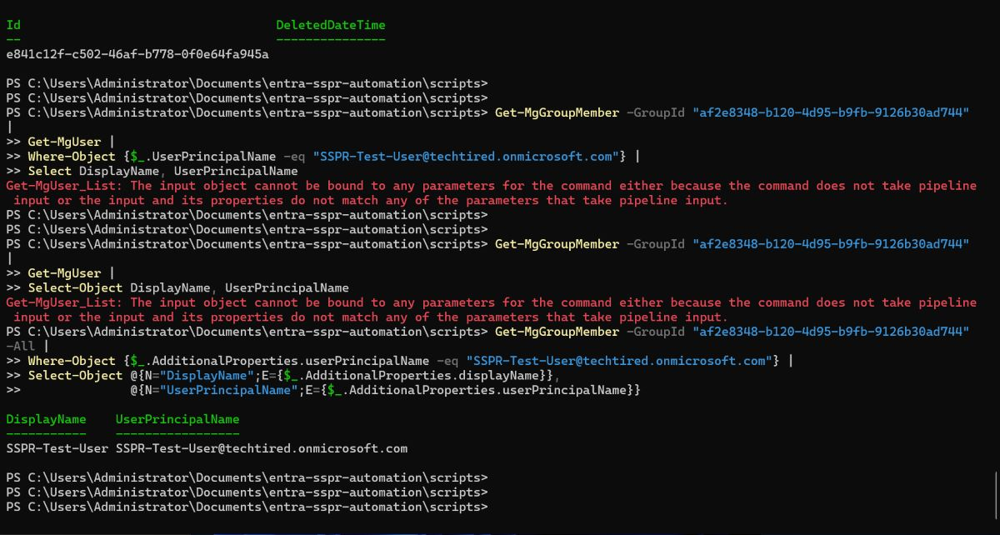

\# Entra ID Self-Service Password Reset (SSPR) Implementation \& Automation

\### Enterprise IAM Deployment using PowerShell + Microsoft Graph


Production-style implementation of Microsoft Entra ID Self-Service Password Reset (SSRP) with automated provisioning, auditing, reporting, and operational documentation. 

Note that the imbedded Scripts includes idempotent logic to prevent duplicate membership assignments.


This project demonstrates how an Identity \& Access Management (IAM) administrator or engineer deploys SSPR in a real organization using:


\- Least-privilege design

\- Security group scoping

\- PowerShell automation

\- Microsoft Graph

\- Operational documentation

\- Troubleshooting procedures

\- End-user enablement


---


\# Project Objectives


Implement an enterprise-ready SSPR solution that:


\- Reduces helpdesk password tickets

\- Enables secure self-service recovery

\- Improves user productivity

\- Enforces identity verification

\- Provides automated readiness checks

\- Follows Infrastructure-as-Code practices


---


\# Skills Demonstrated


This project showcases:


\- Microsoft Entra ID administration

\- Identity lifecycle management

\- PowerShell scripting

\- Microsoft Graph API usage

\- IAM automation

\- Security policy configuration

\- Operational documentation

\- Troubleshooting design

\- Production folder structuring


---


\# Architecture Overview


Users

↓

Security Group (SSPR-Users)

↓

Authentication Methods Policy

↓

Microsoft Entra SSPR Service

↓

Password Reset Portal


Flow:


1\. User forgets password

2\. Verifies identity (SMS/Email)

3\. Sets new password

4\. System updates credentials

5\. Helpdesk ticket avoided


---


\# Folder Structure


entra-sspr-automation

│

├── README.md

├── sspr-implementation.md

│

├── scripts

│ ├── connect-graph.ps1

│ ├── enable-sspr.ps1

│ ├── create-sspr-group.ps1

│ ├── add-users-to-sspr-group.ps1

│ ├── audit-sspr-readiness.ps1

│ └── report-export.ps1

│

├── screenshots

├── diagrams

├── docs

│ ├── user-faq.md

│ ├── admin-troubleshooting.md

│ └── communication-template.md

│

└── reports


---


\# Features Implemented


\## Core Configuration

\- Enable SSPR

\- Configure authentication methods

\- Scope to security group

\- Require verification methods


\## Automation

\- Create SSPR group automatically

\- Bulk add users

\- Audit missing phone numbers

\- Export readiness reports

\- Graph authentication scripts


\## Documentation

\- Admin runbook

\- Troubleshooting guide

\- User FAQ

\- Communication template


\## Operations

\- Monitoring readiness

\- Reporting compliance gaps

\- Repeatable deployment


---


\# Prerequisites


\## Tenant

\- Microsoft Entra ID tenant

\- Global Administrator or Authentication Policy Admin


\## Local machine

\- Windows 10/11

\- PowerShell 7+ (recommended)

\- Microsoft Graph module


Install:


```powershell

Install-Module Microsoft.Graph -Scope CurrentUser

Step-By-Step Deployment

Step 1 — Connect to Microsoft Graph

powershell

Copy code

.\\scripts\\connect-graph.ps1

Prompts for sign-in.


Step 2 — Create SSPR Security Group

powershell

Copy code

.\\scripts\\create-sspr-group.ps1

Creates:


SSPR-Users

Step 3 — Add Users to Group

powershell

Copy code

.\\scripts\\add-users-to-sspr-group.ps1 -GroupId <group-id> -UserPrincipalName user@domain.com

Step 4 — Configure SSPR in Portal

Portal path:


Entra Admin Center

→ Protection

→ Password reset

Enable:


Self-service password reset: Enabled


Scope: Selected group (SSPR-Users)


Authentication methods: Phone + Email


Methods required: 2


Step 5 — Audit Readiness

Find users missing phone numbers:


powershell

.\\scripts\\audit-sspr-readiness.ps1

Step 6 — Export Compliance Report


powershell

.\\scripts\\report-export.ps1


Output:


/reports/sspr-readiness-report.csv

Scripts Explained

connect-graph.ps1

Authenticates session to Microsoft Graph.


create-sspr-group.ps1

Creates security group used for SSPR scoping.


add-users-to-sspr-group.ps1

Bulk or single user assignment.


audit-sspr-readiness.ps1

Identifies users without recovery methods.


report-export.ps1

Exports readiness results to CSV.


Screenshots

Screenshots included for:


Enabling SSPR


Authentication methods


Group scoping


User reset workflow


Successful reset


Location:


/screenshots

Troubleshooting Guide

Common issues:


User cannot reset password

Not in SSPR group


No phone/email configured


Authentication methods disabled


Reset option not visible

SSPR not enabled


Policy not scoped correctly


Graph script fails

Missing permissions


Module not installed


See:


/docs/admin-troubleshooting.md

User FAQ

Provided:


How to enroll


How to reset


What methods are allowed


Who to contact


See:


/docs/user-faq.md

Security Considerations

Least-privilege role assignments


Group-based scoping


No password storage in scripts


No automated password resets


Verification required for every reset


Business Impact

This solution:


Reduces helpdesk workload


Lowers operational cost


Improves recovery time


Enhances user experience


Aligns with Zero Trust principles


Practical IAM deployment


Automation mindset


Scripting ability


Operational thinking


Real enterprise structure


Documentation discipline


Skills relevant to:


IAM Engineer


Entra/Azure AD Admin


Helpdesk → IAM transition


Cloud Security roles


SaaS companies


Enterprise IT


Future Enhancements

MFA enforcement


Conditional Access integration


ServiceNow ticket automation


Scheduled compliance checks


CI/CD deployment


Author

Patrick Nlemchi

Identity \& Access Management | Entra ID | PowerShell | Security Automation


License

Educational / portfolio use

## Test Image

## Screenshots

### 1. Enabling SSPR


### 2. Authentication Methods Configuration


### 3. Test User Added to SSPR Group


### 4. User Reset Workflow


### 5. Test User Successful Sign-In


### 6. Microsoft Graph Connection


### 7. Script Run Successful


### 8. Group Members Verified



